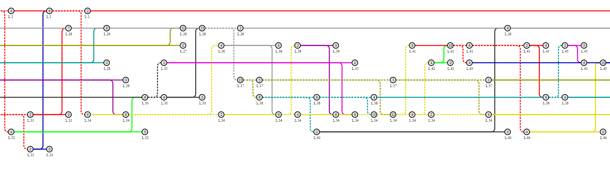

SAMMI
===
## Description

SAMMI, Split & Merge Meaning Information, tries to figure out a meaningful chart to let engineers know How a product is split and merged in whole progress of processing.



## Limitation of chart data

1. create `Node` using API.
   1. name, row & col need to be predefined.
   2. same row with the same name.
2. create `Link` using `Node` from 1.
   1. direction from top-left to bottom-right.


```js
// create a map
var map = uia.sammi.create('sammi1');

// nodes
// nodes> row 1
var n11 = map.node("WD8HQ007.1", 0, 0, 25);
var n12 = map.node("WD8HQ007.1", 1, 0, 23);
var n13 = map.node("WD8HQ007.1", 2, 0, 22);
var n14 = map.node("WD8HQ007.1", 3, 0, 24);
var n15 = map.node("WD8HQ007.1", 4, 0, 25);
// nodes> row 2
var n21 = map.node("WD8HQ007.2", 1, 1, 2);
// nodes> row 3
var n31 = map.node("WD8HQ007.3", 2, 2, 1);

// links
// create links using nodes created above.
map.link(n11, n12, '#ff0000', 'S');
map.link(n11, n21, '#ff0000', 'S');
map.link(n12, n13, '#00ff00', 'S');
map.link(n12, n31, '#00ff00', 'S');
map.link(n13, n14, '#0000ff', 'M');
map.link(n21, n14, '#0000ff', 'M');
map.link(n14, n15, '#666666', 'M');
map.link(n31, n15, '#666666', 'M');

map.fly();
```

## Features

* Selectable.
* Hintable.
* Configurable of column width and row height.
* Fit width for small dataset.


## Copyright and License
Licensed under the Apache License, Version 2.0 (the "License"); you may not use this file except in compliance with the License. You may obtain a copy of the License at

http://www.apache.org/licenses/LICENSE-2.0

Unless required by applicable law or agreed to in writing, software distributed under the License is distributed on an "AS IS" BASIS, WITHOUT WARRANTIES OR CONDITIONS OF ANY KIND, either express or implied. See the License for the specific language governing permissions and limitations under the License.
 